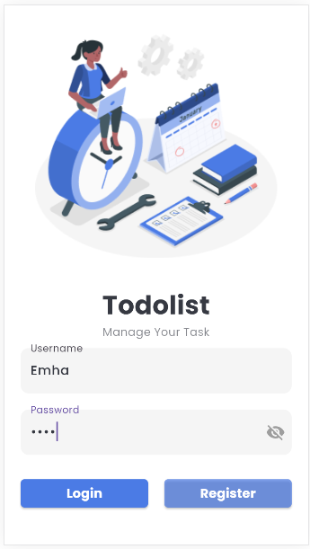
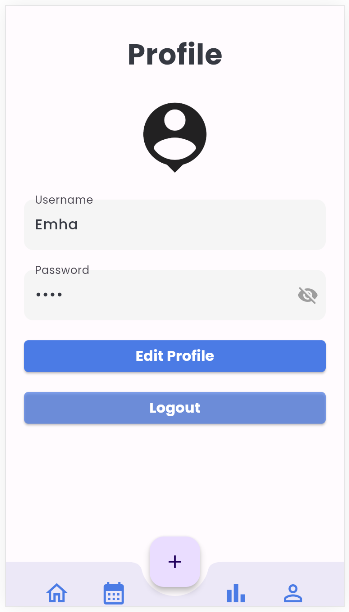
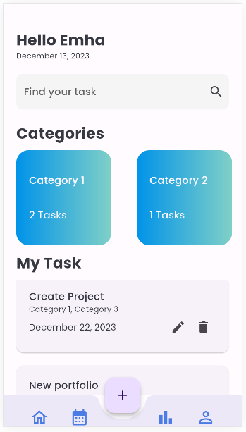
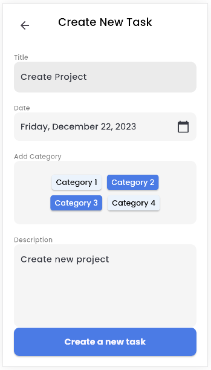

# Todolist

This is todolist app developed using Flutter.

## Design Credits

This application is designed by drawing inspiration from the design created by [Nait Creative](https://www.figma.com/@naitcreative), which can be found on [Figma](https://www.figma.com/community/file/1113091900592641257/ui-kit-task-management).

Special thanks to Nait Creative for providing the amazing design!

## Features

- User Authentication.
- CRUD operation to manage task.
- Categorization for task.

## App Preview

  
  

  
  

## How to Run

1. Make sure you have Flutter installed. If not, follow the [Flutter installation guide](https://flutter.dev/docs/get-started/install).
2. Clone this repository: `git clone https://github.com/bruhtwig/flutter-todolist.git`
3. Open a terminal and navigate to the project directory: `cd flutter-todolist`
4. Run pub get: `flutter pub get`
5. Run the app: `flutter run`

## Contributions

If you'd like to contribute to this project, feel free to create a pull request. We welcome suggestions and improvements!

## License

This project is licensed under the [MIT License](LICENSE).